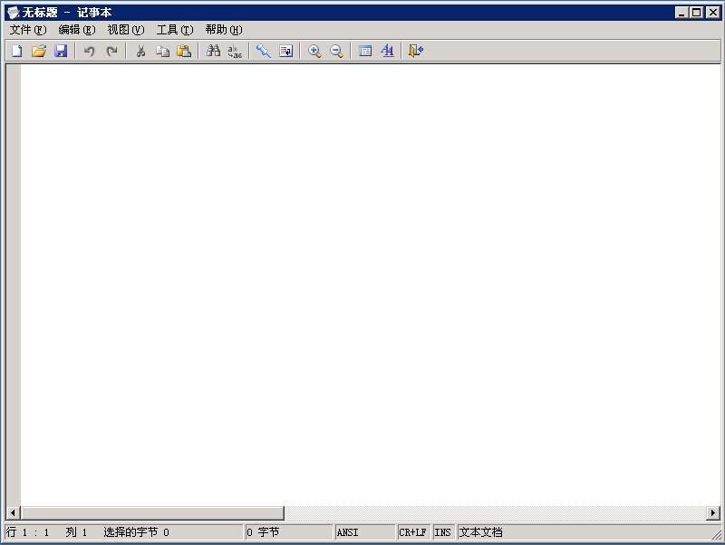
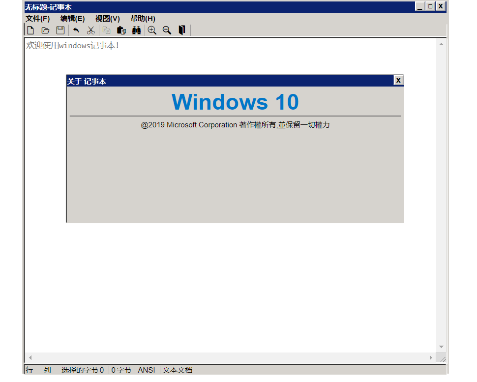

# windows-notepad[网页仿windows记事本]

原版UI

實現效果UI

## 使用技術: HTML5\CSS3\JS
## 第三方库: 无
## 兼容性: chrome\edge\safari\firefox
## 简介:
使用HTML\CSS 还原记事本UI,再使用原生js实现功能逻辑.
可以进一步拓展成为富文本编辑器.
## 亮点:
1.实现纯前端的 打开本地文件 保存下载文本到本地.
2.实现对选中文字的复制粘贴剪切删除.
3.实现对文本向前向后全局的查找替换.
## 具体功能:
#### 文件:
1. 新建文件
2. 开启文件
3. 保存文件
4. 打印
5. 结束
#### 编辑:
1. 还原
2. 剪切
3. 复制
4. 粘贴
5. 删除
6. 查找
7. 找下一个
8. 找上一个
9. 替换
10. 全选
11. 时间/日期
#### 视图:
1. 缩放
2. 状态栏显示隐藏
3. 自动换行
#### 帮助:
1. 使用说明
2. 关于记事本
